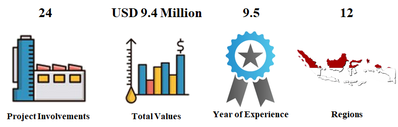
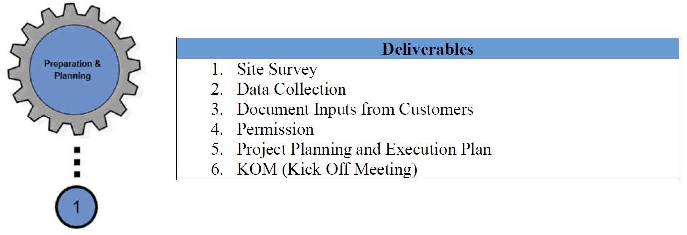
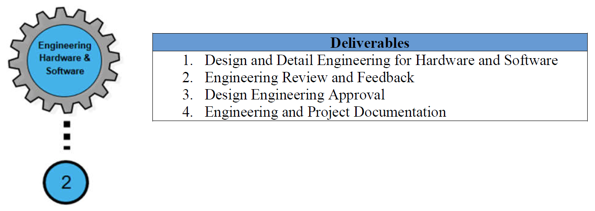
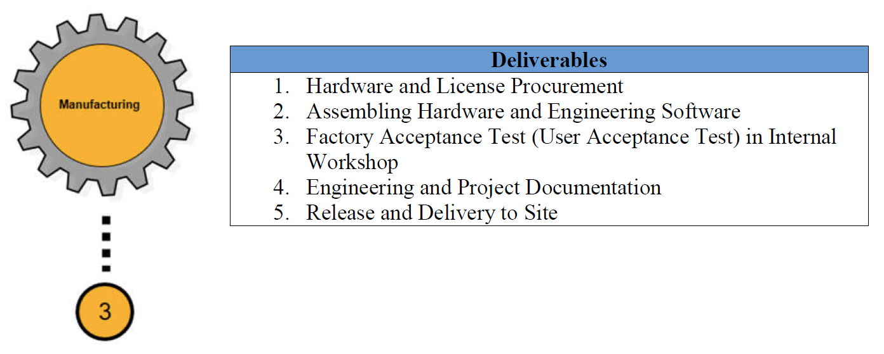

# Industrial Automation
Industrial Automation is the wide range use of technology that reduces human intervention in various types of manufacturing process by implementing various control system and information technologies for operating equipment. This document describes the industry, size, typical workflow, deliverables, role, work sample, and project experiences in which I have ever involved.

## Indusrty Size

I've been involved in several projects with various industries such as Oil & gas, Petrochemical, Pulp and Paper, Energy, Fertilizer, Synthetic Materials, and etc. All the projects are about enhancing manufacturing process that requires control system as its central operation, small to medium size projects, ranging from USD 200K to around USD 4M.

## Typical Workflow / Roadmap
The Workflow / Roadmap, depending on the projects, usually comprises of 5 phases, namely:

